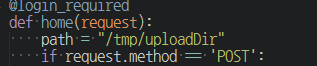

# Splunk File Upload App

- splunk 에 내장된 django를 이용하여 splunk server 에 파일을 올리는 간단한 앱

- 저장 경로는  django/fileUpload/views.py에 path 부분을 수정

  

## Install

- 압축파일 형식으로 되면 앱 관리 - 업로드에서 업로드
- 파일형식이면 \$Splunk_HOME\$/etc/apps에 복사 후 재시작

